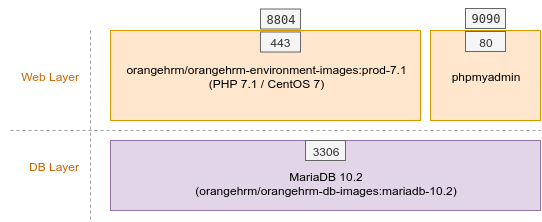

# OrangeHRM PROD Environment - PHP 7.2
   

## Introduction

prod-environment-php72 is a dockerized production environment for OrangeHRM. This dev environment mainly contains three containers as follows,

- web container (PHP 7.2)
- MySQL container (MariaDB 10.2)
- phpmyadmin container

Configuration of each layer has been added according to the OrangeHRM requirements.

## Architecture

## How to use ?

1. Download the zip
2. Extract the downloaded zip file 
3. run `docker-compose up -d` - this will up web, phpmyadmin and database containers

## Notes
- Custom configurations can be added through the docker-compose file. 

## Other Sources

#### Available PROD Environments

- [php 5.6 PROD Environment](https://github.com/orangehrm/orangehrm-prod-environment/tree/prod-environment-php56)
- [php 7.0 PROD Environment](https://github.com/orangehrm/orangehrm-prod-environment/tree/prod-environment-php70)
- [php 7.1 PROD Environment](https://github.com/orangehrm/orangehrm-prod-environment/tree/prod-environment-php71)
- [php 7.2 PROD Environment](https://github.com/orangehrm/orangehrm-prod-environment/tree/prod-environment-php72)

#### Available PROD images

- [php 5.6 image](https://github.com/orangehrm/orangehrm-prod-environment/tree/php-5.6-centos)
- [php 7.0 image](https://github.com/orangehrm/orangehrm-prod-environment/tree/php-7.0)
- [php 7.1 image](https://github.com/orangehrm/orangehrm-prod-environment/tree/php-7.1)
- [php 7.2 image](https://github.com/orangehrm/orangehrm-prod-environment/tree/php-7.2)